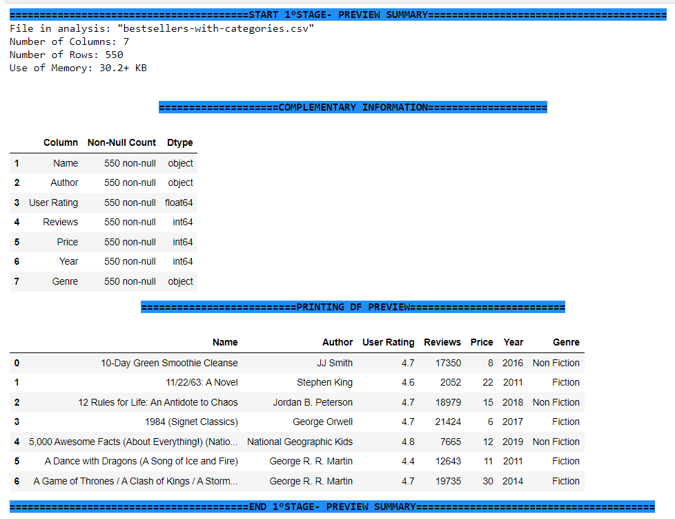

### Master_Analyzer Index

[A fast solution to your Quality Data Analysis](#mark_00)

[Features and Capabilities Overview](#mark_01)

   _ [Capability to Read `".csv", ".rda", ".json" (structured and unstructured), ".xport", and ".xlsx"`](#mark_01.0)
   
   _ [Special Capability to Detect **Nested JSON and LISTS**](#mark_01.1)

   ### A fast solution to your Quality Data Analysis [Index](#index_00)

**Master_Analyzer** was developed with the best Quality Concepts adding the Performance Concepts, to analyze your data in each step of your ETL/ELT process, this idea started in 2024 February, and as a QA Engineer and Data Engineer, after many years of working with different projects I could see this new necessity in the data flow. 

**Master_Analyzer** pretends to be an "All In One" tool, although he is currently a baby, he is growing fast and will offer you new features and capabilities.

###  Features and Capabilities Overview [Index](#index_00)

**Master_Analyzer** can detectec and show you the following features:

_ **Capability to Read** the following format **".csv", ".rda", ".json" (structured and unstructured), ".xport", and ".xlsx"** showing the main features of your interest to check a preview in an easy summary. [Index](#index_00)

_ **Special Capability to Detect Nested JSON and LISTS**, **Master_Analyzer** can detect those complex unstructured schemas and raise a warning. [Index](#index_00)

    _ **"Nested JSON detected"** case, can resolve it for you.
    _ **"lists detected"** case, will display the warning to be resolved according to your business rules.

Detecting those complex unstructured schemas: